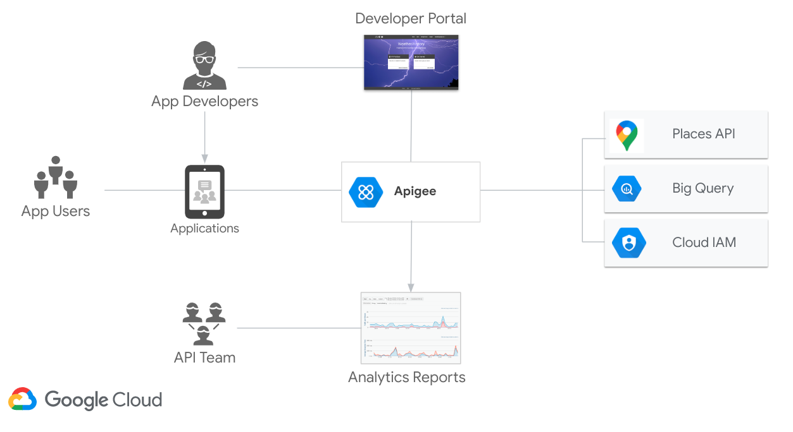

## Apigee Weather History Demo v2
This project contains all of the assets and information you need to deploy and run v2 of the Apigee Weather History demo. The purpose of this demo is to show how easy it is to build APIs with Apigee to leverage GCP native offerings like Big Query. It also demonstrates how someone could expose systems of record that are located in BigQuery securely to other systems through APIs.

## Description
The Apigee Weather History demo has been around for a few years now, this version (v2) tries to leverage new features which have been added to Apigee since then, such as:
- Google Authentication for TargetEndpoints
- CORS policy
- DataCapture policy

In additon v2 makes some incremental changes and improvements such as:
- API Product Quotas
- Scripted config, deployment and cleanup
- Integration test suite to validate setup and generate traffic
- Implements proxy best practice recommendations per apigeelint
- Improvements to HTML front end (also now hosted [Fahrenheit](https://markjkelly.github.io/apigee-notebooks/temps365-f.html) and [Celsius](https://markjkelly.github.io/apigee-notebooks/temps365-f.html))
- API Key moved to request header
- Target Server
- Refactored KVM and Cache

## Overview



## Prerequisites
1. Access to an Apigee X/Hybrid Organization, configured for external access. 
    * [Provision Apigee X](https://cloud.google.com/apigee/docs/api-platform/get-started/provisioning-intro)
    * Configure [external access](https://cloud.google.com/apigee/docs/api-platform/get-started/configure-routing#external-access) for API traffic to your Apigee instance. 
      * Go to Apigee page in a fresh project and click customize setup
      * Click Next until you get to Customize Access Routing
      * Configure external routing
    * Create an intermediate environment under Management > Environments (the default basic environment will not work for this)
2. Access to deploy proxies, create products, apps and developers in Apigee. See permissions [here](https://cloud.google.com/apigee/docs/api-platform/get-started/permissions)
3. Enable the BigQuery API in your project
4. A service account with the following roles:
    * bigquery.user
    * bigquery.dataViewer
5. An API key enabled for use with the Google [Geocoding Service](https://developers.google.com/maps/documentation/javascript/geocoding)
6. Make sure the following tools are available in your terminal's $PATH (Cloud Shell has these preconfigured)
    * [gcloud SDK](https://cloud.google.com/sdk/docs/install)
    * curl
    * jq
    * npm
7. Run these commands
```
echo "Installing dependencies"
npm install --no-fund
echo "Installing apigeecli"
curl -s https://raw.githubusercontent.com/apigee/apigeecli/master/downloadLatest.sh | bash
```
8. Add the following to the end of your ~/.bashrc file: `export PATH=$PATH:$HOME/.apigeecli/bin`

## Setup Instructions

1. Clone this repo, and switch to the apigee-weather-history-demo-v2 directory


```bash
git clone git@gitlab.com:google-cloud-ce/googlers/markjkelly/apigee-weather-history-demo-v2.git
cd apigee-weather-history-demo-v2
```

2. Edit the `env.sh` and configure the ENV vars

* `PROJECT` the project where your Apigee organization is located
* `APIGEE_ORG` the Apigee Organization where the demo artifacts will be deployed. If you setup Apigee in the Google Cloud console, this will be your Project ID
* `APIGEE_ENV` the Apigee environment where the demo artifacts will be deployed
* `APIGEE_HOST` the externally reachable hostname of the Apigee environment group that contains the APIGEE_ENV. You can get this value from the GCP console Apigee page by going to the Environments > Environment Groups tab
* `BIGQUERY_SERVICE_ACCOUNT` The GCP service account which the Apigee proxy will use to autenticate to BigQuery
* `GEOCODE_APIKEY` An API key enabled for use with the Google [Geocoding Service](https://developers.google.com/maps/documentation/places/web-service/get-api-key#gcloud-api-keys-create)

Now source the `env.sh` file

```bash
source ./env.sh
```

3. Deploy Apigee API proxies, products and apps

```bash
./deploy-weather-history-demo-v2.sh
```

### Testing the Proxy / Generating Traffic
To run the integration tests, first retrieve Node.js dependencies with:
```
npm install
```
Ensure the following environment variables have been set correctly:
* `PROXY_URL`
* `APIKEY`

and then run the tests:
```
npm run test
```

## Usage

- [Web Front End Fahrenheit](https://markjkelly.github.io/apigee-notebooks/temps365-f.html)
- [Web Front End Celsius](https://markjkelly.github.io/apigee-notebooks/temps365-f.html)

## Support
Feel free to ping me directly @markjkelly1 or open an issue.

## Roadmap
See the Project Issues page for a list of planned enhancement. Feel free to open and issue if you have additonal ideas or suggestions. 

## Contributing
Contributions welcome! Fork this repo and submit a PR for review.

## Authors and acknowledgment
Thanks to the many CEs who have contributed to this demo in lots of ways - creating assets, documenting features, sharing code and maintaining environments @danekind (created the orginal demo), @mtalreja, @teodlh, @nabilrehman and many others who have helped along the way.

## Project status
Active

## Cleanup

If you want to clean up the artefacts from this example in your Apigee Organization, first source your `env.sh` script, and then run

```bash
./clean-up-weather-history-demo-v2.sh
```
